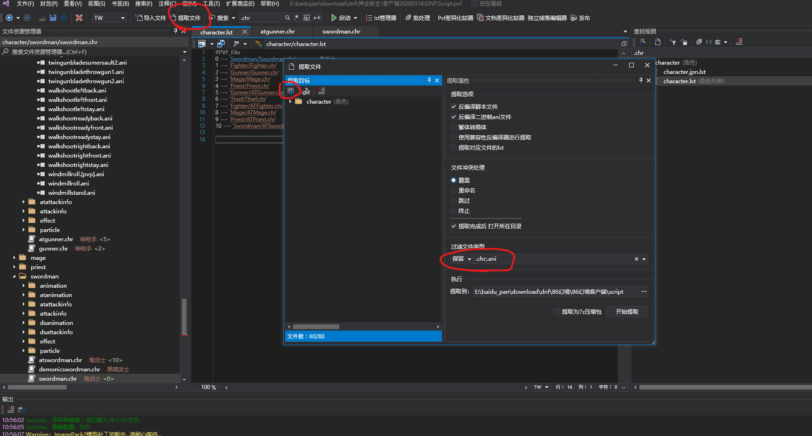

**该工具目前只验证了【神迹新生95】这个版本**
理论上是通用的，但是没做验证。
另外注意你玩的版本有带有残影的绝望塔顶的梁月AI
## 使用流程
**覆盖前请自行备份pvf文件**
1. 解压build_files\pvf_utility里的文件，然后通过里面的pvf编辑器打开你DNF目录里的.pvf文件
2. 
3. 提取文件时会导出到某个文件夹里，默认是pvf同目录的`script`文件夹里
4. 运行build_files下面的spectrum_tool.exe
5. 输入你的character路径到输入框里，注意确认好输出路径
6. 调整参数
7. 工具会帮你补充残影属性
8. 打开输出目录
9. 再次打开你的pvf编辑器然后重新导入7z到里面
